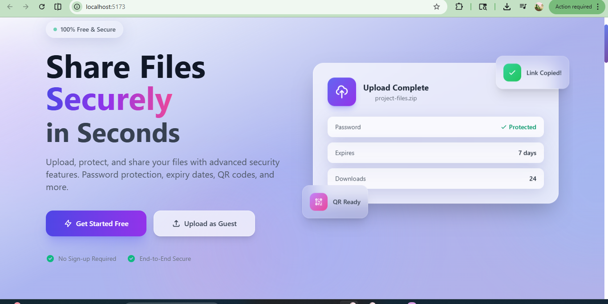
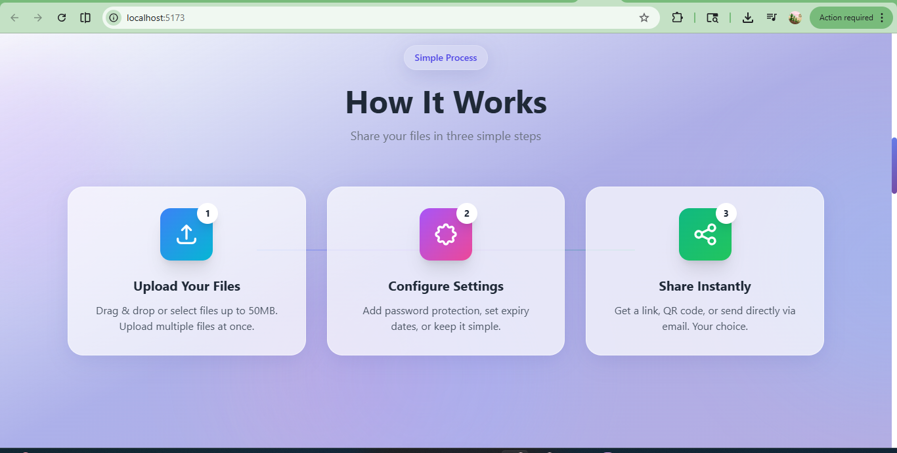
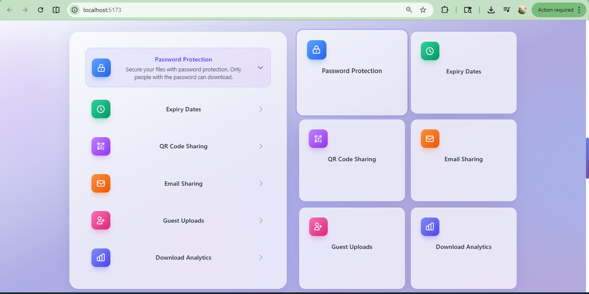
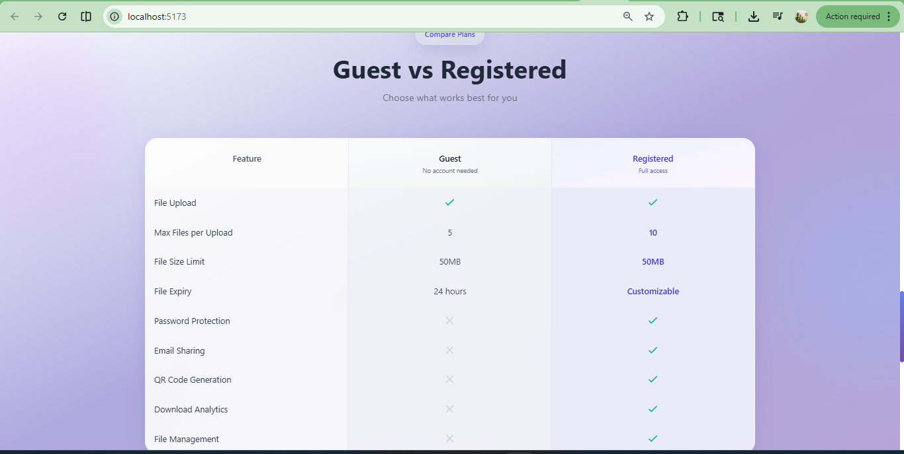
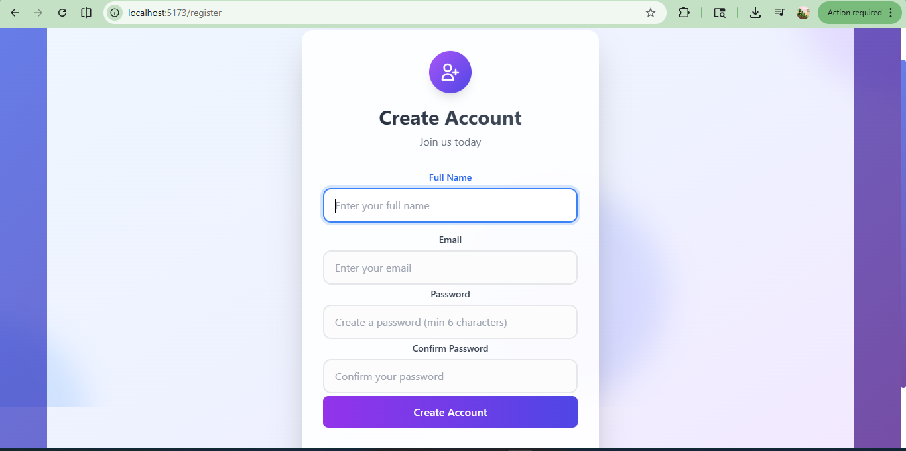
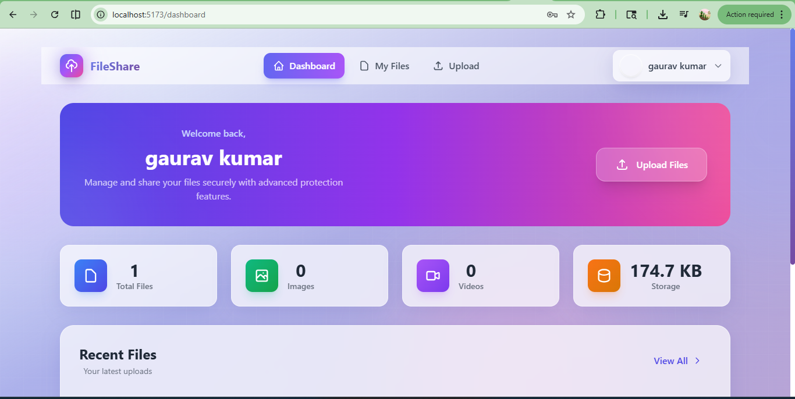
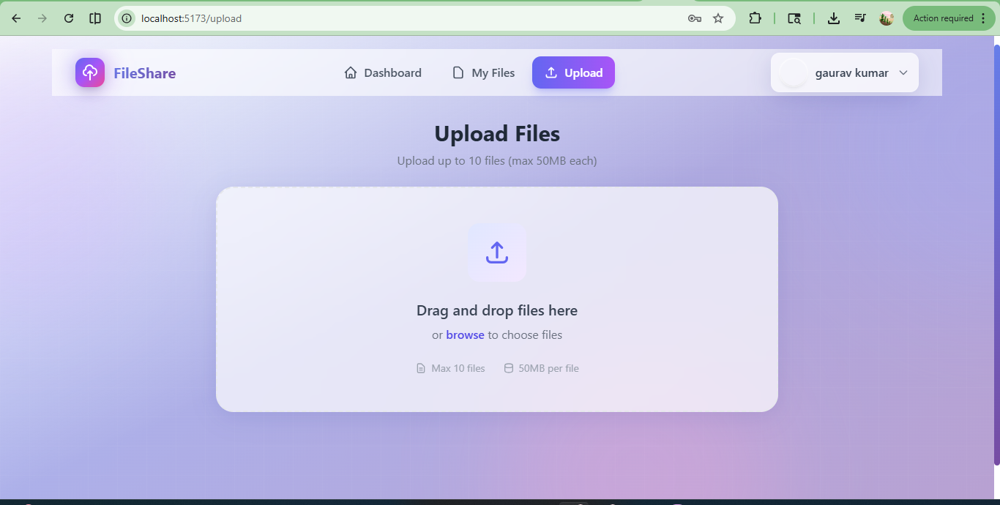
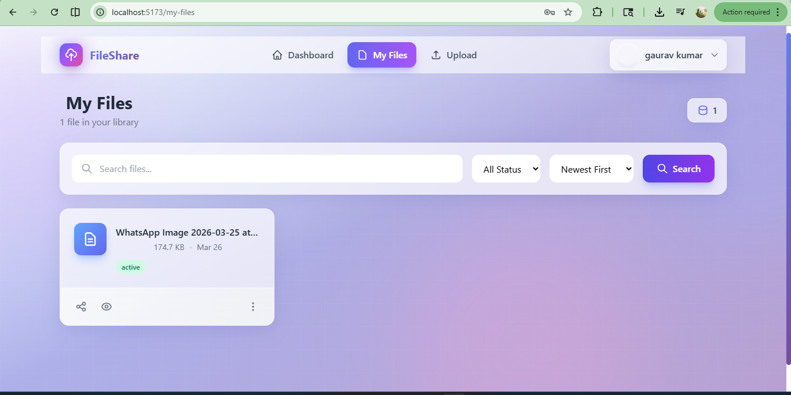

# FileShare - Secure File Sharing Platform

<div align="center">


A modern, full-stack file sharing application with advanced security features including password protection, expiry dates, QR code sharing, and email sharing.

[](https://react.dev/)
[](https://nodejs.org/)
[](https://mongodb.com/)
[](https://tailwindcss.com/)


</div>

---


---

## Features

### For Registered Users
- **User Authentication** - Secure register, login, and logout with JWT
- **File Upload** - Upload up to 10 files (max 50MB each)
- **File Management** - View, search, filter, and paginate your files
- **Password Protection** - Secure files with password protection
- **Expiry Dates** - Set custom expiration dates for files
- **Share via Link** - Generate short URLs for easy sharing
- **Share via QR Code** - Generate QR codes for mobile sharing
- **Share via Email** - Send files directly to recipients via email
- **Download Analytics** - Track download counts for your files
- **Profile Dashboard** - View upload statistics and manage your account

### For Guest Users
- **No Account Required** - Upload files without registration
- **Quick Sharing** - Get shareable links instantly
- **Upload up to 5 files** (max 50MB each)
- **Automatic 24-hour Expiry** - Guest files expire automatically


| Feature | Guest | Registered |
|---------|:-----:|:----------:|
| File Upload | ✅ | ✅ |
| Max Files per Upload | 5 | 10 |
| File Size Limit | 50MB | 50MB |
| File Expiry | 24 hours | Customizable |
| Password Protection | ❌ | ✅ |
| Email Sharing | ❌ | ✅ |
| QR Code Generation | ❌ | ✅ |
| Download Analytics | ❌ | ✅ |
| File Management | ❌ | ✅ |

---

## Screenshots

### Landing Page
 





### Register Page


### Dashboard



### Upload Page


### My Files



---

## Tech Stack

### Frontend
| Technology | Purpose |
|------------|---------|
| **React 19** | UI Library |
| **Axios** | HTTP Client |
| **Tailwind CSS** | Styling |
| **Vite** | Build Tool |

### Backend
| Technology | Purpose |
|------------|---------|
| **Node.js** | Runtime |
| **Express.js** | Web Framework |
| **MongoDB** | Database |
| **JWT** | Authentication |
| **Bcrypt.js** | Password Hashing |
| **Cloudinary** | File Storage |
| **Multer** | File Upload Handling |
| **Nodemailer** | Email Service |
| **QRCode** | QR Generation |
| **ShortID** | URL Shortening |

---

## Project Structure

```
File-Sharing/
├── client/                          # Frontend (React)
│   ├── src/
│   │   ├── api/
│   │   │   ├── authApi.js           # Auth API functions
│   │   │   ├── axios.js             # Axios instance
│   │   │   └── fileApi.js           # File API functions
│   │   ├── components/
│   │   │   ├── auth/
│   │   │   │   └── ProtectedRoute.jsx
│   │   │   ├── files/
│   │   │   │   ├── FileCard.jsx
│   │   │   │   ├── FileDetailsModal.jsx
│   │   │   │   └── ShareModal.jsx
│   │   │   ├── shared/
│   │   │   │   ├── Layout.jsx
│   │   │   │   └── Navbar.jsx
│   │   │   └── Input.jsx
│   │   ├── context/
│   │   │   └── AuthContext.jsx      # Auth state management
│   │   ├── pages/
│   │   │   ├── Dashboard.jsx
│   │   │   ├── GuestUpload.jsx
│   │   │   ├── Home.jsx
│   │   │   ├── Login.jsx
│   │   │   ├── MyFiles.jsx
│   │   │   ├── Profile.jsx
│   │   │   ├── Register.jsx
│   │   │   ├── SharedFile.jsx
│   │   │   └── Upload.jsx
│   │   ├── App.jsx
│   │   ├── App.css
│   │   ├── index.css
│   │   └── main.jsx
│   ├── package.json
│   ├── tailwind.config.js
│   └── vite.config.js
│
├── server/                          # Backend (Node.js)
│   ├── config/
│   │   ├── cloudinary.js            # Cloudinary config
│   │   └── db.js                    # MongoDB connection
│   ├── controllers/
│   │   ├── file_controller.js       # File operations
│   │   └── user_controller.js       # User operations
│   ├── middleware/
│   │   ├── auth_middleware.js       # JWT verification
│   │   ├── authorizeUser.js         # Authorization
│   │   └── multer.js                # File upload config
│   ├── models/
│   │   ├── file.js                  # File schema
│   │   ├── guestFile.js             # Guest file schema
│   │   └── user.js                  # User schema
│   ├── routes/
│   │   ├── file_routes.js           # File endpoints
│   │   └── user_routes.js           # User endpoints
│   ├── server.js                    # Entry point
│   └── package.json
│
└── README.md
```

---

## Getting Started

### Prerequisites

- **Node.js** (v18 or higher)
- **MongoDB** (local or MongoDB Atlas)
- **Cloudinary Account** (for file storage)
- **Gmail Account** (for email sharing feature)

### Environment Variables

#### Server (`server/.env`)

```env
PORT=5000
MONGO_URI=mongodb://localhost:27017/fileshare
JWT_SECRET=your_super_secret_jwt_key_here
NODE_ENV=development

# Cloudinary Configuration
CLOUDINARY_CLOUD_NAME=your_cloud_name
CLOUDINARY_KEY=your_api_key
CLOUDINARY_SECRET=your_api_secret

# Email Configuration (Gmail)
EMAIL_USER=your_email@gmail.com
EMAIL_PASS=your_app_password
```


#### Client (`client/.env`)

```env
VITE_BACKEND_URI=http://localhost:5000/api
```

### Installation

1. **Clone the repository**
   ```bash
   git clone https://github.com/Gaurav77Kumar/file-sharing.git
   cd file-sharing
   ```

2. **Install server dependencies**
   ```bash
   cd server
   npm install
   ```

3. **Install client dependencies**
   ```bash
   cd ../client
   npm install
   ```

4. **Set up environment variables**
   - Create `.env` file in `server/` folder
   - Create `.env` file in `client/` folder
   - Fill in the required values as shown above

### Running the App

#### Development Mode

**Terminal 1 - Start the server:**
```bash
cd server
npm run dev
```
Server runs on `http://localhost:5000`

**Terminal 2 - Start the client:**
```bash
cd client
npm run dev
```
Client runs on `http://localhost:5173`

#### Production Mode

**Build the client:**
```bash
cd client
npm run build
```

**Start the server:**
```bash
cd server
npm start
```

---

## API Reference

### Authentication Endpoints

| Method | Endpoint | Description | Auth |
|--------|----------|-------------|:----:|
| `POST` | `/api/auth/register` | Register new user | No |
| `POST` | `/api/auth/login` | Login user | No |
| `POST` | `/api/auth/logout` | Logout user | No |
| `GET` | `/api/auth/users` | Get all users (admin) | Yes |
| `GET` | `/api/auth/users/:userId` | Get user by ID | Yes |
| `PATCH` | `/api/auth/users/:userId` | Update user | Yes |
| `DELETE` | `/api/auth/users/:userId` | Delete user | Yes |

### File Endpoints (Authenticated)

| Method | Endpoint | Description |
|--------|----------|-------------|
| `POST` | `/api/files/upload` | Upload files (max 10) |
| `GET` | `/api/files/user-files` | Get all user files |
| `GET` | `/api/files/my-files` | Get files with pagination |
| `GET` | `/api/files/search` | Search files |
| `GET` | `/api/files/details/:fileId` | Get file details |
| `GET` | `/api/files/download/:fileId` | Download file |
| `DELETE` | `/api/files/delete/:fileId` | Delete file |
| `PATCH` | `/api/files/status/:fileId` | Update file status |
| `PATCH` | `/api/files/expiry/:fileId` | Update file expiry |
| `PATCH` | `/api/files/password/:fileId` | Set/remove password |
| `GET` | `/api/files/share-link/:fileId` | Generate share link |
| `POST` | `/api/files/send-email/:fileId` | Send file via email |
| `GET` | `/api/files/qr/:fileId` | Generate QR code |

### Public/Guest Endpoints

| Method | Endpoint | Description |
|--------|----------|-------------|
| `POST` | `/api/files/guest/upload` | Guest upload (max 5 files) |
| `GET` | `/api/files/share/:shortUrl` | Access shared file |
| `POST` | `/api/files/verify-password/:fileId` | Verify file password |
| `GET` | `/api/files/guest/download-info/:shortUrl` | Get guest file info |

---


---

</div>
